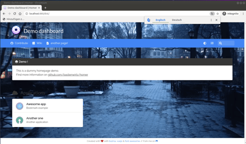

# homer_video_backg
homer_video_backg

this a simple modification to get a video background in your selfhosted homer dashboard.
just copy and paste it over your existing [homer dashboard](https://github.com/bastienwirtz/homer) installation.
dont forget to create the video/ directory and put a video in it.
the app.*.css is needed to play the video under the header

